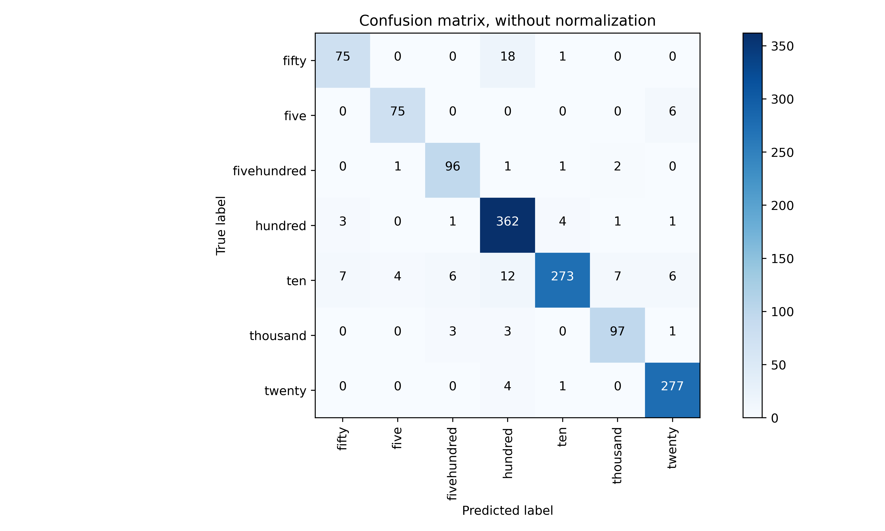
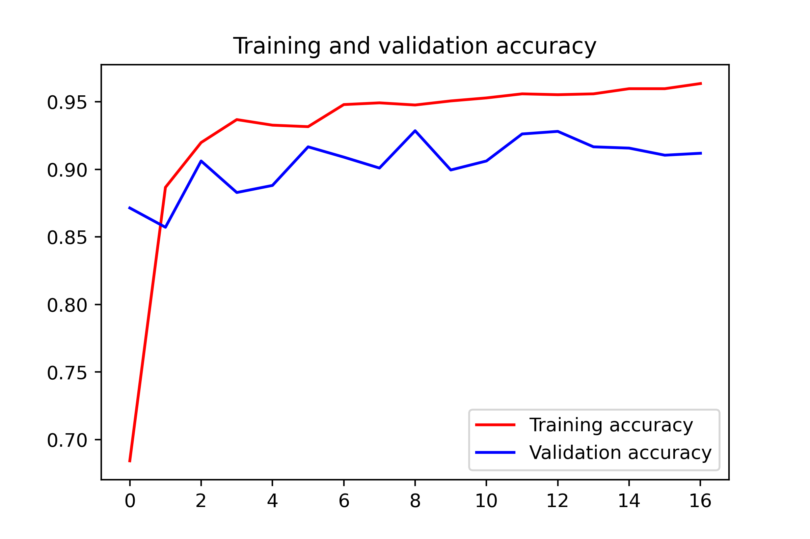
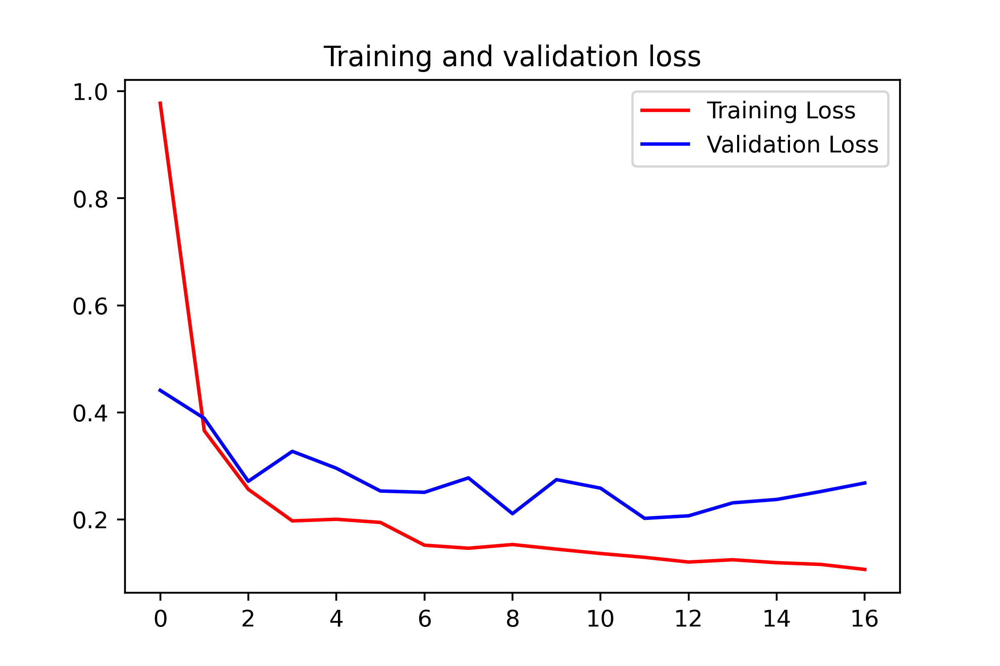

# Nepali Cash Detection and Recognition Using Transfer Learning and InceptionV3
This project focuses on detecting and recognizing Nepali cash using transfer learning and the InceptionV3 model. The model achieved 91% accuracy on both test and validation data.

## Dataset
The dataset used in this project consists of images of Nepali cash denominations. The dataset contains seven classes, namely:

* fifty
* five
* fivehundred
* hundred
* ten
* thousand
* twenty

## Model
Transfer learning was used to train the model using the InceptionV3 architecture. The model was trained on the dataset for 10 epochs with a batch size of 64. The model achieved an accuracy of 91% on both test and validation data.

## Results
The model achieved an accuracy of 91% on both test and validation data. The confusion matrix for the model is shown below:



### Training and Validation Accuracy


In this example, the model is being trained and evaluated for 10 epochs. During training, the model is being optimized by minimizing the loss and maximizing the accuracy.

After each epoch, the model's performance is evaluated on a validation dataset, which is different from the training dataset. This helps to check if the model is overfitting to the training data or if it's learning general patterns that can be applied to new data.

The training accuracy refers to the accuracy of the model on the training dataset after each epoch. It indicates how well the model is learning the patterns in the training data.

The validation accuracy refers to the accuracy of the model on the validation dataset after each epoch. It indicates how well the model is generalizing to new data.

In this example, we can see that the model starts with a training accuracy of 0.7324 and a validation accuracy of 0.85 in the first epoch. This means that the model is performing better on the training dataset than the validation dataset, indicating that it may be overfitting.

However, as the number of epochs increases, we can see that the validation accuracy also increases, reaching a maximum of 0.9290 in the ninth epoch. This suggests that the model is learning more general patterns that can be applied to new data.

In the last epoch, we can see that the training accuracy is 0.9495, while the validation accuracy drops to 0.9043. This indicates that the model may be overfitting to the training data, and further training may not improve its performance on new data.


### Training and validation loss


In the context of a machine learning model, the training and validation loss are measures of how well the model is performing during the training and validation phases, respectively.

The loss function is a measure of how well the model is able to predict the correct output. During training, the model is adjusted to minimize this loss. A low training loss indicates that the model is fitting the training data well, whereas a high training loss indicates that the model is not fitting the data well.

Validation loss is the loss computed on a set of data that is not used for training, and it is used to assess how well the model is generalizing to new data. If the validation loss is low, it indicates that the model is performing well on unseen data. If the validation loss is much higher than the training loss, it may indicate that the model is overfitting the training data and is not generalizing well.

In the example given, we can see that the training loss and accuracy decrease and increase respectively as the epochs increase, while the validation loss and accuracy fluctuate. The decrease in training loss and increase in training accuracy indicates that the model is fitting the training data better with each epoch.

## Conclusion
In conclusion, this project has demonstrated the effectiveness of transfer learning and the InceptionV3 model for detecting and recognizing Nepali cash denominations with an accuracy of 91%.


# Streamlit web application
To run the application, you need to have Streamlit installed on your computer. If you don't have Streamlit installed, you can install it by running the following command in your terminal or command prompt:

```bash
pip install streamlit
```
Once Streamlit is installed, navigate to the directory where your main.py file is located using your terminal or command prompt. Then, run the command:

```bash
streamlit run main.py
```

This should start the Streamlit server and open the web application in a new tab in your default web browser.


Now Upload the Images inside `image-data-inference`


Another Example


